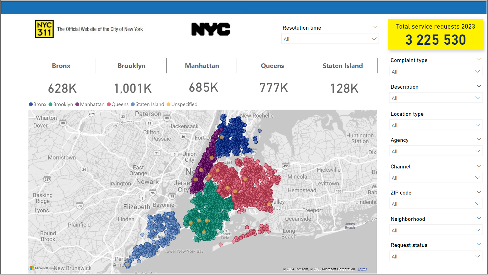
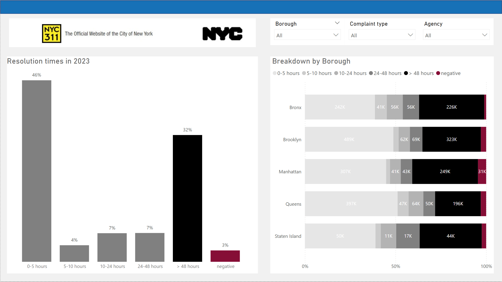
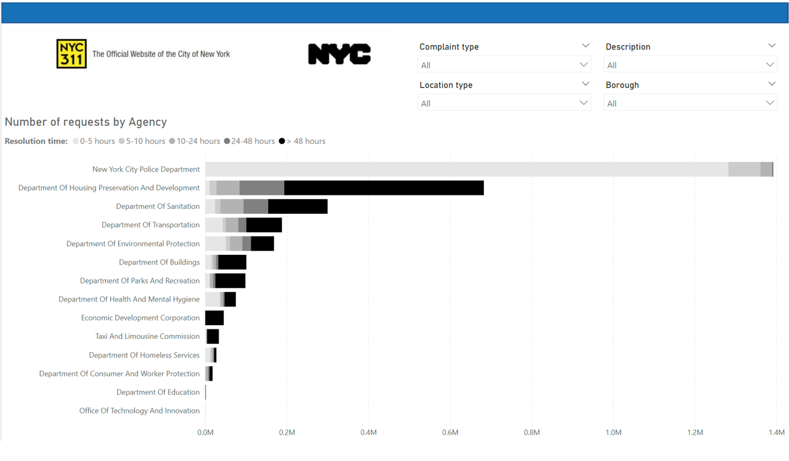
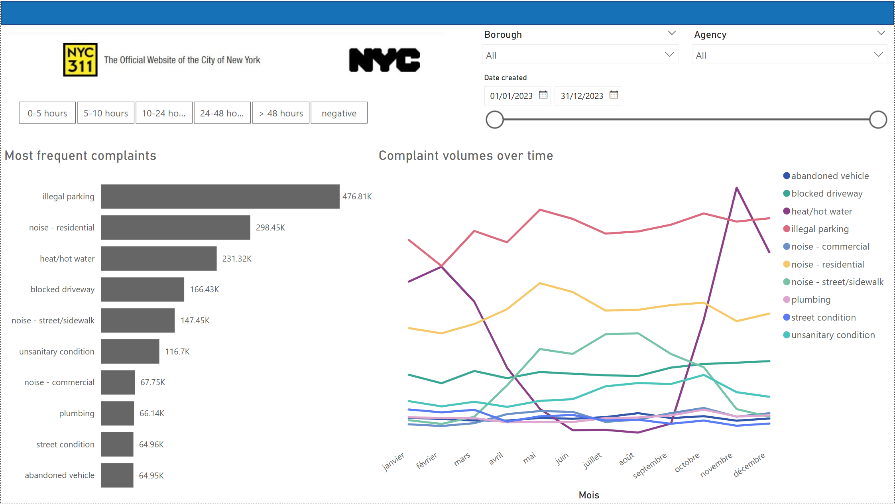
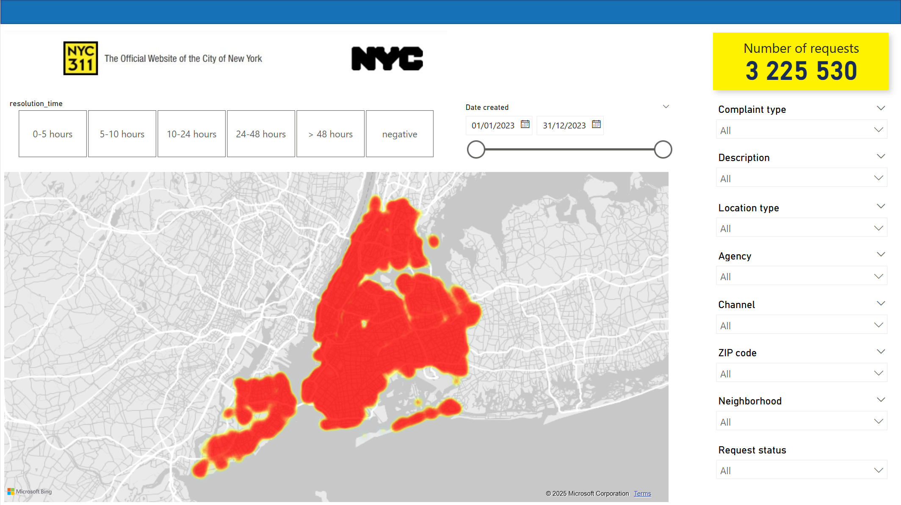
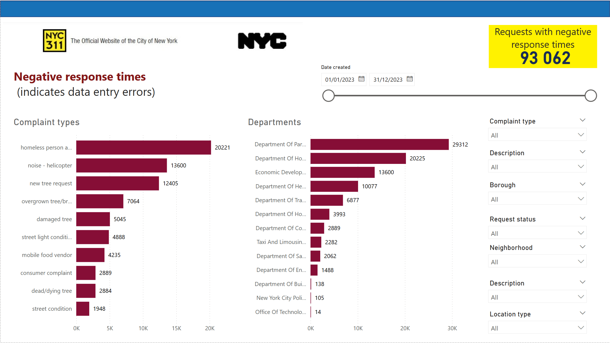

# Improving public service response times with NYC311 Service Requests data 🚕

---

## Contributors  

This end-to-end data analysis project was developed as part of the **Fullstack Data Analysis** training programme at **Jedha Bootcamp**.  

The project was a collaborative effort by:  
- **[Ned Chambers](https://www.linkedin.com/in/nedchambers/)** – dataset sourcing and business problem analysis, data cleaning and transformation, machine learning preparation and predictive modelling in Dataiku, data visualisation in Power BI, and GitHub documentation.  
- **[Iryna Vorobiova](https://www.linkedin.com/in/iryna-vorobiova-374604170/)** – data cleaning and transformation, exploratory data analysis (EDA), data visualisation in Python and Power BI, and dashboard wireframing and prototyping.  
- **[David Charpentier](https://www.linkedin.com/in/david-charpentier-2b5479165/)** – data cleaning and transformation, data modelling and visualisation in Power BI, and PowerPoint documentation.  

Together, we conducted data analysis, machine learning, and visualisation to derive actionable insights from **NYC 311 Service Requests**, helping public servants improve urban management strategies.

---

## Skills showcased

- **End-to-end data project management**, covering the full lifecycle from data extraction, cleaning, and analysis to predictive modelling and visualisation.  
- **Data analysis and visualisation** with Python libraries and Power BI.  
- **Dashboard development**, creating an interactive Power BI dashboard with filtering capabilities.  
- **Machine learning and predictive modelling** in Dataiku.  
- **Data cleaning and transformation** using Python and Power Query.  
- **ETL pipelines**, extracting, transforming, and preparing data for analysis.  
- **Business insights and decision-making**, identifying key factors impacting service response times.  

---

# 1. Executive summary

This project presents a comprehensive analysis of **NYC311 Service Requests** data, aiming to uncover trends, enhance response times, and provide actionable insights for urban management.

**NYC311** is the **official non-emergency service request system** for New York City, allowing residents to report issues related to **housing, sanitation, noise complaints, infrastructure, and other public services**. Requests are handled by various city agencies, with response times varying based on issue complexity and resource availability.  

## 1.1 Key findings

- **Resolution times:**  
  - Approximately **64.84%** of complaints are resolved within 48 hours.  
  - The **shortest resolution times (0-10 minutes)** occur for requests that can be **automatically classified or quickly assessed**, such as **duplicate reports, noise complaints, or illegal parking**, often handled by the **NYPD**.  
  - The **longest resolution times (over 48 hours)** involve **complex interventions**, such as:
    - **Mold complaints in residential buildings** (average **60+ days**) due to required inspections and landlord cooperation.  
    - **Tree pruning or removal requests** (average **90+ days**) due to limited resources and/or lower prioritisation by the **Department of Parks & Recreation**.

- **Factors affecting resolution times:**  
  - **Fast resolutions:** Requests involving **automatic classification, minor infractions, or quick visual inspections** tend to have **low resolution times**.  
  - **Long resolutions:** Complaints requiring **multi-agency coordination, detailed inspections, or legal procedures** (such as **housing violations, road repairs, or abandoned vehicle removal**) have **extended resolution times**.

- **Agency performance:**  
  - The **New York City Police Department (NYPD)** efficiently resolves many noise and parking-related issues within minutes, and almost all non-urgent complaints within 48 hours.  
  - Agencies like the **Department of Housing Preservation and Development (HPD), the Department of Transportation (DOT), and the Department of Sanitation (DSNY)** are linked to **longer resolution times** due to the complexity of their cases and resource allocation challenges.

## 1.2 Methodologies employed

- **Data processing:** Cleaned and transformed the dataset using **Python** and its data analysis libraries (Pandas, NumPy, Matplotlib, Seaborn)**.  
- **Exploratory data analysis (EDA):** Identified trends, outliers, and key factors affecting response times.  
- **Visualisation:** Developed an interactive **Power BI dashboard** to dynamically explore resolution times across complaint types, agencies, and locations.  
- **Predictive modelling:** Built a **machine learning model in Dataiku** to flag requests likely to **exceed 48-hour resolution times**, helping prioritise urgent cases and optimise resource allocation.

## 1.3 Business implications

This analysis provides actionable insights to improve NYC service request handling by:  

- **Enhancing resource allocation:** Identifying complaint types and locations with chronic delays allows targeted **deployment of resources**.  
- **Process optimisation:** Agencies can streamline workflows for **common delay factors** to improve efficiency.  
- **Policy improvements:** Data-driven insights can guide policy decisions to **enhance service responsiveness and public satisfaction**.

By leveraging these findings, NYC agencies can **improve service delivery, reduce response times, and optimise urban management strategies**.

---

# 2. Project Overview

This project analyses data from **NYC311 Service Requests** to uncover trends, identify opportunities to improve response times, and provide actionable insights for urban management. The dataset includes information on complaints related to a wide range of areas overseen by city services.

---

## 2.1 About NYC311 Service Requests

NYC311 is the official non-emergency services and information portal for New York City residents and visitors. Launched in 2003, it serves as a centralised hub for reporting issues, accessing City services, and obtaining information about City government programmes. Through various channels—including phone, web, and a mobile application—users can report problems and receive updates on the status of their inquiries.

According to NYC311’s Website, “a Service Request is your request for the City to provide you with assistance, perform an inspection, or address a problem. NYC311 can accept Service Requests for a wide range of issues, including over 500 complaint types. Service Requests can help you get a pothole fixed in your neighborhood, the heat turned on in your apartment, or a refund for an overpaid parking ticket.”

---

## 2.2 Objectives

- Explore and visualise trends in service requests.
- Identify key drivers of service efficiency and delays.
- Develop a predictive machine learning model to help public service agents flag if a request is likely to take over 48 hours to complete, in order to help prioritise tasks, allocate resources efficiently, and optimise service response times.
- Propose actionable recommendations for improving response times from city services.

---

## 2.3 Dataset

- **Source**: [NYC Open Data: 311 Service Requests from 2010 to Present](https://data.cityofnewyork.us/Social-Services/311-Service-Requests-from-2010-to-Present/erm2-nwe9/about_data)
- **Size**: 38.8 million rows and 41 columns (filtered down to records from 2023 only = 3.26 million rows).
- **Description**: Each row corresponds to a NYC311 service request filed by a member of the public. Key columns for the analysis include:
    - `created_date`: The date and time when the service request was filed by the user.
    - `closed_date`: The date and time when the request was closed by the responding agency.
    - `agency_name`: The full name of the responding City Government Agency.
    - `complaint_type`: Identifies the topic of the incident or condition the request pertains to (e.g., Illegal Parking, Plumbing, Street Condition).
    - `descriptor`: Provides further detail related to the incident or condition, associated with the `complaint_type`.
    - `location_type`: Describes the type of location used in the address information (e.g., Residential, Commercial, Government building).
    - `status`: The status of the service request submitted (e.g., open, assigned, in progress, pending, or closed).
    - `resolution_description`: Describes the last action taken on the request by the responding agency.
    - `borough`: The NYC borough in which the request was submitted, provided by the submitter and confirmed by geovalidation.
    - `open_data_channel_type`: Indicates how the request was submitted to 311 (e.g., By Phone, Online, Mobile, Other, or Unknown).
    - `latitude`: The geo-based latitude of the incident location.
    - `longitude`: The geo-based longitude of the incident location.

---

## 2.4 Methodology

1. Data cleaning, and preprocessing.
2. Exploratory data analysis (EDA) in Python for trends and outliers.
3. Visualisation of findings using an interactive dashboard in Power BI.
4. Predictive modelling in Dataiku: flagging requests likely to have longer resolution times.

---

## 2.5 Data cleaning and transformation

The dataset was primarily pre-processed using Python in Visual Studio Code with the Pandas library to prepare it for exploratory data analysis in Python and Power BI, as well as machine learning in Dataiku. Additional pre-processing steps were performed within each respective tool as needed.

The following steps outline the process used to clean and prepare the data for analysis:

### 2.5.1 Importing and initial exploration

- A query was executed on the NYC Open Data platform to retrieve only the records from 2023. The data was then exported in CSV format.
- Columns were reviewed for standardization and inconsistencies.

### 2.5.2 Data cleaning and transformation

1. **Column standardisation**: Cleaned column headers to ensure consistency:
    - Stripped leading and trailing spaces.
    - Replaced spaces between words with underscores (`_`).
    - Converted all column names to lowercase.
2. **Handling missing values**: Identified and managed missing values in key columns, with specific transformations integrated into later steps, such as datatype conversions:
    - Set “nan” as the default value in columns that require textual representation to allow for easy filtering in Power BI.
    - Filled missing values in geospatial data columns (latitude/longitude) with the default coordinates of the `borough` the request was filed in.
3. **Datatype conversions:** Converted specific columns to their appropriate data types:
    - **Text columns:** Standardised columns that required textual representation.
    - **Date/time columns:** Converted columns to datetime format to facilitate time-based calculations (e.g., `created_datetime` and `closed_datetime`).
    - Ensured proper handling of errors during the conversion process.
4. **Feature engineering:**
    - **`flag_new_york_city`**: Created a binary column to indicate whether a request location falls within the five boroughs of New York City, using a predefined mapping.
    - **`location_type_general`**: Simplified the original `location_type` column by grouping detailed types into broader categories (e.g., Residential, Commercial, Public Space) based on a custom dictionary mapping.
    - `created_date_hour` , `created_date_date` , `closed_date_hour` , `closed_date_date`, `due_date_hour` , `due_date_date` , `resolution_action_updated_date_hour` , `resolution_action_updated_date_date` : Created separate columns for the hour and the date from datetime columns to facilitate easier time series analysis in Power BI.
    - **`resolution_time_hours`**: Calculated the time taken to resolve each request in hours by subtracting the `created_datetime` from the `closed_datetime`. Key column for analysis.
    - Unnecessary columns were removed to streamline the dataset:
        - `location` : Redundant as `latitude` and `longitude`  already present.
        - `agency` : Abbreviation for full agency name (present in `agency_name` ).
5. **Categorical data cleaning**:
    - Duplicates were removed.
    - Typographical errors were corrected.
    - Similar values were grouped for consistency.
    - Categorical columns were converted to the "category" data type for performance efficiency and to facilitate the creation of columns with hierarchically ordered values (e.g. `status` ).

### 2.5.3 Data splitting for analysis

- The dataset was split into three subsets for exploratory data analysis (EDA) and machine learning:
    1. **All requests**: Contains the complete transformed dataset (for exploration in Power BI).
    2. **Positive response times**: Includes only requests with valid (positive) response times (for dedicated exploratory analysis in Python and to train the predictive Dataiku model).
    3. **Negative response times**: Includes only requests with “negative” response times (for exploration into the factors behind these anomalies in Python and Dataiku).

### 2.5.4 Exportation

- The cleaned and processed data was exported to three separate CSV files for further analysis.

---

# 3. Exploratory data analysis (EDA) insights

## 3.1 Resolution time analysis

- **64.84% of complaints are resolved within 48 hours**.
- The **shortest resolution times (0-10 minutes)** primarily involve complaints that can be automatically classified or quickly assessed, likely requiring minimal human intervention.
- The **longest resolution times (2+ days)** typically involve complex interventions, such as detailed inspections, investigations, or corrective work, which require more resources and coordination.

## 3.2 Factors influencing resolution times

### 3.3 **Fast resolutions**
- **Automatic classification:**
  - Duplicate cases detected and merged.
  - If no violation found (e.g., noise complaints, rodent sightings): closed after automated assessment.
  - Some complaints simply redirect users to self-service resources instead of direct intervention.
- **Police quick assessments:**
  - The NYPD resolves many noise and illegal parking complaints within minutes via quick on-site checks.
- **Minimal physical intervention:**
  - Issues like off-leash dogs and minor sanitation concerns may be resolved with warnings rather than inspections.

### 3.4 **Long resolutions**
- **Complex repairs and inspections:**
  - Infrastructure issues (streetlights, hydrants, road conditions, mold, sanitation violations) require multiple steps and coordination.
  - Housing-related complaints require access and coordination between agencies, landlords, and tenants.
- **Administrative & legal delays:**
  - Ownership verification (e.g. abandoned vehicles) and legal procedures (e.g. illegal construction) slow down resolution.
  - Some cases close with 'no violation found', leading to repeated submissions and extended resolution times.

## 3.3 Key agencies and their role
- **Fast resolutions:**
  - **New York City Police Department (NYPD)**: Noise complaints, illegal parking, quick resolutions.
  - **Department of Health and Mental Hygiene**: Rodent-related complaints.
  - **Department of Environmental Protection**: Water leaks, open hydrants.
- **Slow resolutions:**
  - **Department of Buildings (DOB)**: Illegal construction and structural inspections.
  - **Department of Housing Preservation and Development (HPD)**: Unsanitary housing complaints.
  - **Department of Transportation (DOT)**: Road and infrastructure repairs.
  - **Department of Parks and Recreation**: Public space maintenance.

## 3.4 Implications for NYC services
- **Faster classification** and **automated filtering** reduce resolution times, but **may leave issues unresolved**.
- Complex repairs and legal processes contribute to delays, requiring better coordination and follow-up mechanisms.
- Resource allocation should **prioritise high-impact complaint types** and **locations with frequent delays**.

---

# 4. Power BI dashboard

A Power BI dashboard was then made for dynamic exploration of factors influencing the response times of public service requests made to NYC311.

---

## 4.1 Data cleaning and transformation in Power Query

The cleaned dataset underwent further transformations in Power Query to prepare it for analysis in Power BI.

1. **Importing:**
- The cleaned dataset was loaded into Power Query for transformation.
2. **Feature engineering - creation of `resolution_time`field:**
- A new column, `resolution_time` was added, applying conditional logic to create bins for the resolution time of service requests based on values in `resolution_time_hours` column for easier categorisation of requests.
- Another column, `resolution_time_sort_order`, was created to provide values to sort `resolution_time` by, so that `resolution_time` acts as an ordered categorical variable and categories display in the correct order in visuals.

---

## 4.2 Dashboard features

The Power BI dashboard is divided into several interactive pages, each providing dynamic insights into a different aspect of the city’s public service requests and their response times:

1. **Overview:**
    - Provides a global overview of service requests made to NYC311 in 2023, with a point map showing where each service request was created (broken down by borough).
    - Slicers and buttons allow users to filter the map by:
        - Resolution time
        - Borough
        - Complaint type
        - Description
        - Location type
        - Agency
        - Channel
        - Zip code
        - Neighborhood
        - Request status
    - Cards showing the total number of service requests overall and the number of service requests for each borough are automatically updated according to the filters selected.

2. **Resolution times:**
- Provides a global breakdown of resolution times for NYC311 service requests in 2023.
- A stacked bar chart shows the percentage of the total number of service requests for each resolution time category (0-5 hours, 5-10 hours, 10-24 hours, 24-48 hours, >48 hours, and negative response times).
- A horizontal 100% stacked bar chart allows users to see the breakdown of resolution time categories for each borough.
- Long resolution times (>48 hours) are shown in black, while erroneous “negative” response times are shown in red.
- Slicers allow users to filter by:
    - Borough
    - Complaint type
    - Agency

3. **Agencies:**
- Allows users to see the request volume and response times for each NYC city government agency.
- A horizontal stacked bar chart shows the number of requests and the breakdown of resolution times for each agency, with longer response times shown in black.
- Slicers provide the ability to filter by:
    - Complaint type
    - Complaint description
    - Location type
    - Borough

4. **Complaint types**:

- Provides insights into the most frequent types of complaints and seasonal trends in complaint types.
- A horizontal bar chart allows users to see the 10 most frequent complaints for the applied filters.
- A line graph provides insights into how the complaint volumes for these top 10 complaints change over time, providing insights into seasonal trends.
- Slicers and buttons allow users to filter by:
    - Resolution time
    - Borough
    - Agency
    - Date created

5. **Heatmap**:
- Allows users to see the density of service requests made in different parts of New York City via a heatmap.
- Provides insights into hotspots for different types of service requests.
- Buttons and slicers allow for detailed filtering by:
    - Resolution time
    - Date created
    - Complaint type
    - Complaint description
    - Location type
    - Agency
    - Channel
    - Zip code
    - Agency
    - Neighborhood
    - Request status

5. **Negative response times**:
- Allows city officials to better understand which types of requests are recorded with erroneous “negative” response times, indicating data entry errors.
- Helps users understand how to improve the quality of NYC311 data by identifying problematic data and exploring the factors behind it.
- Provides stacked bar charts showing volume of “negative” response times by complaint type and by agency.
- Slicers allow users to filter by:
    - Date created
    - Complaint type
    - Description
    - Borough
    - Request status
    - Neighborhood
    - Description
    - Location type
      

---

## 4.3 Demonstration

Below is a showcase of the interactive features of the dashboard:

---

# 5. Predictive modelling (Dataiku)

## 5.1 Data preprocessing for machine learning

The cleaned and transformed dataset was further prepared in Dataiku for machine learning, focusing on creating a robust and unbiased model. Key preprocessing steps included:

1. **Importing and data validation**:
    - Imported the **Positive Response Times** dataset from a CSV file.
    - Validated column data types and descriptions to ensure compatibility with Dataiku’s machine learning workflow.
2. **Feature selection and engineering**:
    - **Target variable creation**:
        - Created the target column, `flag_longer_than_48h`, a binary feature indicating whether a request’s resolution time (`resolution_time_hours`) exceeds 48 hours (`1`) or not (`0`).
    - **Feature engineering**:
        - Extracted date components from the `created_date` column, creating additional features such as `created_hour`, `created_dow` (day of the week), `created_week_of_year`, and `created_month`.
        - Selected relevant columns for the model, including:
            - **Target variable**: `flag_longer_than_48h`
            - **Key features**: `agency`, `complaint_type`, `borough`, `flag_new_york_city`, and `location_type_general`.
    - **Noise and leakage mitigation**:
        - Removed 22 columns likely to cause data leakage (e.g., `status`, `resolution_time_hours`, `created_date`, `closed_date`, `due_date`, `resolution_action_updated_date`, `resolution_description`, and their derivatives).
        - Excluded features contributing noise, such as `unique_key`, `latitude`, and `longitude`.
3. **Data splitting**:
    - Split the dataset into training (80%) and testing (20%) subsets to evaluate model performance.
    - Used **class rebalancing** as a sampling method to ensure an even distribution of both target values (`0` and `1`) in the training set, minimizing potential biases during model training.

---

## 5.2 **Model development and evaluation**

- **Model training**:
    - Trained Logistic Regression and Random Forest Models to predict whether a service request would take over 48 hours to resolve.
    - Selected Logistic Regression as the final model due to it outperforming the Random Forest model slightly in all evaluation metrics, including ROC AUC, F1 Score, Accuracy, Precision and Recall (see below).
- **Evaluation metrics**:

    The model's performance was assessed using various evaluation metrics, demonstrating its strong predictive ability:

1. **Confusion matrix**:

    The confusion matrix indicates the model performs well at distinguishing between delayed and non-delayed requests, with relatively low false positives and false negatives. This balance suggests the model is effective for prioritising cases likely to exceed the 48-hour threshold.
   

   
2. **Classification metrics**:

    - **Accuracy**: 87% of predictions were correct, indicating good overall performance.
    - **Precision**: 77%, showing the proportion of correctly identified 1 (longer than 48 hours) predictions out of all predicted 1 values. A focus on reducing false positives could further improve this.
    - **Recall**: 89%, highlighting the model's ability to identify most true 1 instances. This is particularly valuable when missing delayed requests has higher consequences.
    - **F1-Score**: 82%, balancing precision and recall, showcasing the model's effectiveness in handling imbalanced data.

---

## 5.3 **Key insights from the Dataiku model**

1. **Model performance**:
    - The model demonstrated strong performance, with an **accuracy of 87%**, an **F1-score of 82%**, and an **ROC AUC of 0.952**, indicating excellent discrimination between delayed and non-delayed requests.
    - The high **recall (89%)** ensures the model effectively identifies the majority of delayed requests, critical for resource prioritization.
      
2. **Feature Importance**:

- The most significant predictor of delayed resolution times was:
      
  - **Agency Name (`agency_name`)**: This feature contributed 53% to the model's predictive power, underscoring the critical role of the responding agency in determining resolution times.
          
    - The **New York City Police Department (NYPD)** consistently contributed to a negative prediction, indicating response times under 48 hours. This suggests that the NYPD has efficient processes in place to manage its large volume of service requests. Additionally, the nature of their requests may inherently require quicker resolution or may involve relatively straightforward actions (e.g., a phone call or a site visit).
    - In contrast, the **Department of Housing Preservation and Development**, the **Department of Transportation**, and the **Department of Sanitation** were strongly associated with longer response times. These delays are likely due to logistical challenges such as:
        - The complexity of resolving infrastructure-related issues or coordinating inspections.
        - The need for collaboration across multiple teams or agencies.
        - Potential resource allocation constraints or high service demands.
                  
  - **Complaint Type (`complaint_type`)** accounted for 10% of feature importance, indicating that the nature of the request significantly impacts the likelihood of delays (e.g. infrastructure or maintenance-related complaints tend to take considerably longer to resolve).
  - **Location Type (`location_type`)** and **Descriptor (`descriptor`)** contributed 5% each, reflecting the importance of contextual details about where and what the issue is.
  - **Day of the Week (`created_dow`)** represented 3%: feature importance shows that requests created over the weekend took longer to resolve.
  - Less influential but still relevant features included location-related features such as `cross_street_1`, `address_type` and `incident_zip`,  which provide additional contextual information for the model.

3. **Insights on feature contribution**:
    - The dominance of `agency_name` suggests that delays are heavily influenced by operational factors within specific agencies, such as resource allocation or workload.
    - Temporal features like `created_dow` and `created_hour` highlight opportunities to optimise staffing during peak or off-hours.
    - The predictive power of `complaint_type` and `location_type` underscores the need for tailored strategies to address recurring delays in high-priority complaint categories or specific types of locations.
      
4. **Implications for urban management**:
    - Focused improvements in underperforming agencies could significantly reduce resolution delays.
    - Analysing specific complaint types and locations with high delay probabilities can guide resource allocation to areas with the greatest impact.
    - Temporal patterns offer opportunities to optimize staffing and operations during identified periods of high service demand.

---

# 6. Technologies used
The following tools and technologies were used to develop this project:

- **Python**: For cleaning, transforming and exploring the dataset.
- **Power BI**: For creating the interactive dashboard.
- **Power Query**: For further transformations of the dataset to prepare it for use in Power BI.
- **Dataiku**: For further preprocessing for Machine Learning and predictive modelling of response times.
- **GitHub**: For version control and project hosting.

---

# 7. Future improvements
Possible future improvements to this project include:

- Implementing a real-time data pipeline to continuously update the dashboard & ML model (e.g. using Apache Airflow and a cloud-hosted datalake and data warehouse)
- Refactoring the data preprocessing code in DAG format (for use in Apache Airflow) & for better readability
- Investing in Power BI and Dataiku licenses to facilitate deployment
- Adding a function to allow NYC agencies and public users to submit feedback

**Other ideas?** Please make a pull request or email ned.chambers@gmail.com 📧 (Suggestions will be considered for integration from April 2025 onwards)

---

# 8. Project repository structure

NYC311-Service-Requests/
│── data/                    # Google Drive links to raw and processed data files
│── notebooks/                # Jupyter Notebooks for EDA
│── scripts/                  # Python scripts for preprocessing and analysis
│── dashboards/               # Google Drive link to Power BI `.pbix` files
│── models/                   # Dataiku ML model artifacts
│── images/                   # Visualisations and screenshots
│── README.md                 # The file you are reading now
