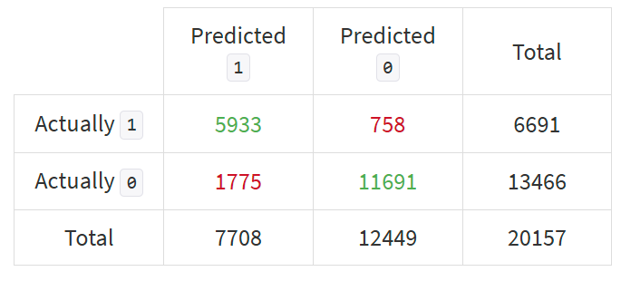
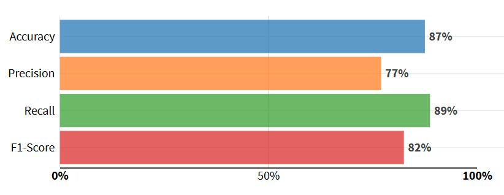
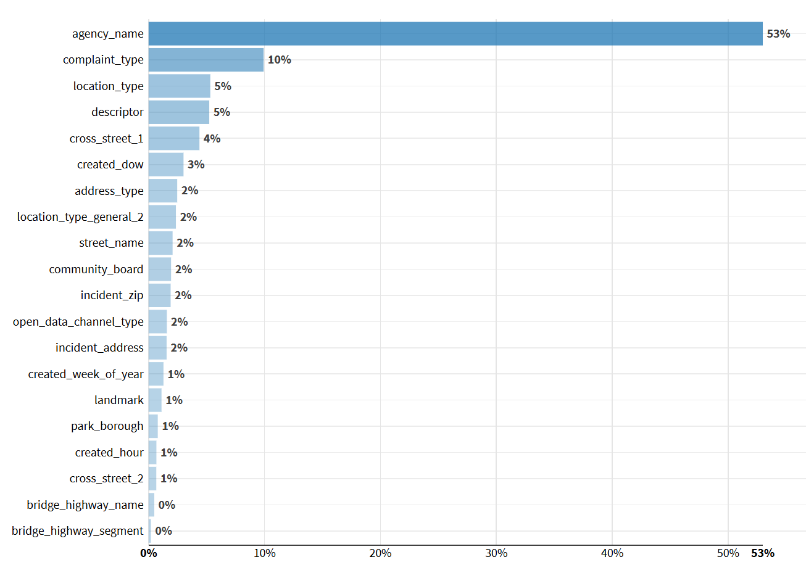

# NYC311 Service Requests Analysis

## Project Overview

This project analyses data from **NYC 311 Service Requests** to uncover trends, identify opportunities to improve response times, and provide actionable insights for urban management. The dataset includes information on complaints related to a wide range of areas overseen by city services.

## About NYC311 Service Requests

NYC311 is the official non-emergency services and information portal for New York City residents and visitors. Launched in 2003, it serves as a centralised hub for reporting issues, accessing City services, and obtaining information about City government programmes. Through various channels—including phone, web, and a mobile application—users can report problems and receive updates on the status of their inquiries.

According to NYC311’s Website, “a Service Request is your request for the City to provide you with assistance, perform an inspection, or address a problem. NYC311 can accept Service Requests for a wide range of issues, including over 500 complaint types. Service Requests can help you get a pothole fixed in your neighborhood, the heat turned on in your apartment, or a refund for an overpaid parking ticket.”

## Objectives

- Explore and visualize trends in service requests.
- Identify key drivers of service efficiency and delays.
- Develop a predictive machine learning model to help public service agents flag if a request is likely to take over 48 hours to complete, in order to help prioritise tasks, allocate resources efficiently, and optimise service response times.
- Propose actionable recommendations for improving response times from city services.

## Dataset

- **Source**: [NYC Open Data: 311 Service Requests from 2010 to Present](https://data.cityofnewyork.us/Social-Services/311-Service-Requests-from-2010-to-Present/erm2-nwe9/about_data)
- **Size**: 38.8 million rows and 41 columns (filtered down to records from 2023 only = 3.26 million rows).
- **Description**: Each row corresponds to a NYC311 service request filed by a member of the public. Key columns for the analysis include:
    - `created_date`: The date and time when the service request was filed by the user.
    - `closed_date`: The date and time when the request was closed by the responding agency.
    - `agency_name`: The full name of the responding City Government Agency.
    - `complaint_type`: Identifies the topic of the incident or condition the request pertains to (e.g., Illegal Parking, Plumbing, Street Condition).
    - `descriptor`: Provides further detail related to the incident or condition, associated with the `complaint_type`.
    - `location_type`: Describes the type of location used in the address information (e.g., Residential, Commercial, Government building).
    - `status`: The status of the service request submitted (e.g., open, assigned, in progress, pending, or closed).
    - `resolution_description`: Describes the last action taken on the request by the responding agency.
    - `borough`: The NYC borough in which the request was submitted, provided by the submitter and confirmed by geovalidation.
    - `open_data_channel_type`: Indicates how the request was submitted to 311 (e.g., By Phone, Online, Mobile, Other, or Unknown).
    - `latitude`: The geo-based latitude of the incident location.
    - `longitude`: The geo-based longitude of the incident location.

## Methodology

1. Data cleaning, and preprocessing.
2. Exploratory data analysis (EDA) in Python for trends and outliers.
3. Predictive modeling in Dataiku: flagging requests likely to have longer resolution times.
4. Visualisation of findings using an interactive dashboard in Power BI.

## Data Cleaning and Transformation

The dataset was primarily pre-processed using Python in Visual Studio Code with the Pandas library to prepare it for exploratory data analysis in Python and Power BI, as well as machine learning in Dataiku. Additional pre-processing steps were performed within each respective tool as needed.

The following steps outline the process used to clean and prepare the data for analysis:

### Importing and Initial Exploration

- A query was executed on the NYC Open Data platform to retrieve only the records from 2023. The data was then exported in CSV format.
- Columns were reviewed for standardization and inconsistencies.

### Data Cleaning and Transformation

1. **Column Standardisation**: Cleaned column headers to ensure consistency:
    - Stripped leading and trailing spaces.
    - Replaced spaces between words with underscores (`_`).
    - Converted all column names to lowercase.
2. **Handling Missing Values**: Identified and managed missing values in key columns, with specific transformations integrated into later steps, such as datatype conversions:
    - Set “nan” as the default value in columns that require textual representation to allow for easy filtering in Power BI.
    - Filled missing values in geospatial data columns (latitude/longitude) with the default coordinates of the `borough` the request was filed in.
3. **Datatype Conversions:** Converted specific columns to their appropriate data types:
    - **Text Columns:** Standardised columns that required textual representation.
    - **Date/Time Columns:** Converted columns to datetime format to facilitate time-based calculations (e.g., `created_datetime` and `closed_datetime`).
    - Ensured proper handling of errors during the conversion process.
4. **Feature Engineering:**
    - **`flag_new_york_city`**: Created a binary column to indicate whether a request location falls within the five boroughs of New York City, using a predefined mapping.
    - **`location_type_general`**: Simplified the original `location_type` column by grouping detailed types into broader categories (e.g., Residential, Commercial, Public Space) based on a custom dictionary mapping.
    - `created_date_hour` , `created_date_date` , `closed_date_hour` , `closed_date_date`, `due_date_hour` , `due_date_date` , `resolution_action_updated_date_hour` , `resolution_action_updated_date_date` : Created separate columns for the hour and the date from datetime columns to facilitate easier time series analysis in Power BI.
    - **`resolution_time_hours`**: Calculated the time taken to resolve each request in hours by subtracting the `created_datetime` from the `closed_datetime`. Key column for analysis.
    - Unnecessary columns were removed to streamline the dataset:
        - `location` : Redundant as `latitude` and `longitude`  already present.
        - `agency` : Abbreviation for full agency name (present in `agency_name` ).
5. **Categorical Data Cleaning**:
    - Duplicates were removed.
    - Typographical errors were corrected.
    - Similar values were grouped for consistency.
    - Categorical columns were converted to the "category" data type for performance efficiency and to facilitate the creation of columns with hierarchically ordered values (e.g. `status` ).

### Data Splitting for Analysis

- The dataset was split into three subsets for exploratory data analysis (EDA) and machine learning:
    1. **All Requests**: Contains the complete transformed dataset (for exploration in Power BI).
    2. **Positive Response Times**: Includes only requests with valid (positive) response times (for dedicated exploratory analysis in Python and to train the predictive Dataiku model).
    3. **Negative Response Times**: Includes only requests with “negative” response times (for exploration into the factors behind these anomalies in Python and Dataiku).

### Exportation

- The cleaned and processed data was exported to three separate CSV files for further analysis.

## Predictive Modeling (Dataiku)

### Data Preprocessing for Machine Learning

The cleaned and transformed dataset was further prepared in Dataiku for machine learning, focusing on creating a robust and unbiased model. Key preprocessing steps included:

1. **Importing and Data Validation**:
    - Imported the **Positive Response Times** dataset from a CSV file.
    - Validated column data types and descriptions to ensure compatibility with Dataiku’s machine learning workflow.
2. **Feature Selection and Engineering**:
    - **Target Variable Creation**:
        - Created the target column, `flag_longer_than_48h`, a binary feature indicating whether a request’s resolution time (`resolution_time_hours`) exceeds 48 hours (`1`) or not (`0`).
    - **Feature Engineering**:
        - Extracted date components from the `created_date` column, creating additional features such as `created_hour`, `created_dow` (day of the week), `created_week_of_year`, and `created_month`.
        - Selected relevant columns for the model, including:
            - **Target Variable**: `flag_longer_than_48h`
            - **Key Features**: `agency`, `complaint_type`, `borough`, `flag_new_york_city`, and `location_type_general`.
    - **Noise and Leakage Mitigation**:
        - Removed 22 columns likely to cause data leakage (e.g., `status`, `resolution_time_hours`, `created_date`, `closed_date`, `due_date`, `resolution_action_updated_date`, `resolution_description`, and their derivatives).
        - Excluded features contributing noise, such as `unique_key`, `latitude`, and `longitude`.
3. **Data Splitting**:
    - Split the dataset into training (80%) and testing (20%) subsets to evaluate model performance.
    - Used **class rebalancing** as a sampling method to ensure an even distribution of both target values (`0` and `1`) in the training set, minimizing potential biases during model training.

### **Model Development and Evaluation**

- **Model Training**:
    - Trained Logistic Regression and Random Forest Models to predict whether a service request would take over 48 hours to resolve.
    - Selected Logistic Regression as the final model due to it outperforming the Random Forest model slightly in all evaluation metrics, including ROC AUC, F1 Score, Accuracy, Precision and Recall (see below).
- **Evaluation Metrics**:

    The model's performance was assessed using various evaluation metrics, demonstrating its strong predictive ability:

1. **Confusion Matrix**:

    The confusion matrix indicates the model performs well at distinguishing between delayed and non-delayed requests, with relatively low false positives and false negatives. This balance suggests the model is effective for prioritising cases likely to exceed the 48-hour threshold.
   

   
2. **Classification Metrics**:

    - **Accuracy**: 87% of predictions were correct, indicating good overall performance.
    - **Precision**: 77%, showing the proportion of correctly identified 1 (longer than 48 hours) predictions out of all predicted 1 values. A focus on reducing false positives could further improve this.
    - **Recall**: 89%, highlighting the model's ability to identify most true 1 instances. This is particularly valuable when missing delayed requests has higher consequences.
    - **F1-Score**: 82%, balancing precision and recall, showcasing the model's effectiveness in handling imbalanced data.

### **Key Insights from the Dataiku Model**

1. **Model Performance**:
    - The model demonstrated strong performance, with an **accuracy of 87%**, an **F1-score of 82%**, and an **ROC AUC of 0.952**, indicating excellent discrimination between delayed and non-delayed requests.
    - The high **recall (89%)** ensures the model effectively identifies the majority of delayed requests, critical for resource prioritization.
      
3. **Feature Importance**:

- The most significant predictor of delayed resolution times was:
      
  - **Agency Name (`agency_name`)**: This feature contributed 53% to the model's predictive power, underscoring the critical role of the responding agency in determining resolution times.
          
    - The **New York City Police Department (NYPD)** consistently contributed to a negative prediction, indicating response times under 48 hours. This suggests that the NYPD has efficient processes in place to manage its large volume of service requests. Additionally, the nature of their requests may inherently require quicker resolution or may involve relatively straightforward actions (e.g., a phone call or a site visit).
    - In contrast, the **Department of Housing Preservation and Development**, the **Department of Transportation**, and the **Department of Sanitation** were strongly associated with longer response times. These delays are likely due to logistical challenges such as:
        - The complexity of resolving infrastructure-related issues or coordinating inspections.
        - The need for collaboration across multiple teams or agencies.
        - Potential resource allocation constraints or high service demands.
                  
  - **Complaint Type (`complaint_type`) a**ccounted for 10% of feature importance, indicating that the nature of the request significantly impacts the likelihood of delays (e.g. infrastructure or maintenance-related complaints tend to take considerably longer to resolve).
  - **Location Type (`location_type`)** and **Descriptor (`descriptor`) c**ontributed 5% each, reflecting the importance of contextual details about where and what the issue is.
  - **Day of the Week (`created_dow`) r**epresented 3%: feature importance shows that requests created over the weekend took longer to resolve.
  - Less influential but still relevant features included location-related features such as `cross_street_1`, `address_type` and `incident_zip`,  which provide additional contextual information for the model.

5. **Insights on Feature Contribution**:
    - The dominance of `agency_name` suggests that delays are heavily influenced by operational factors within specific agencies, such as resource allocation or workload.
    - Temporal features like `created_dow` and `created_hour` highlight opportunities to optimise staffing during peak or off-hours.
    - The predictive power of `complaint_type` and `location_type` underscores the need for tailored strategies to address recurring delays in high-priority complaint categories or specific types of locations.
      
6. **Implications for Urban Management**:
    - Focused improvements in underperforming agencies could significantly reduce resolution delays.
    - Analysing specific complaint types and locations with high delay probabilities can guide resource allocation to areas with the greatest impact.
    - Temporal patterns offer opportunities to optimize staffing and operations during identified periods of high service demand.
    - 

## Exploratory Data Analysis (EDA) Insights

### Resolution Time Analysis

- **64.84% of complaints are resolved within 48 hours**.
- The **shortest resolution times (0-10 minutes)** primarily involve complaints that can be automatically classified or quickly assessed, likely requiring minimal human intervention.
- The **longest resolution times (2+ days)** typically involve complex interventions, such as detailed inspections, investigations, or corrective work, which require more resources and coordination.

### Factors Influencing Resolution Times

#### **Fast Resolutions**
- **Automatic Classification:**
  - Duplicate cases detected and merged.
  - No violation found (e.g., noise complaints, rodent sightings) closed after automated assessment.
  - Some complaints simply redirect users to self-service resources instead of direct intervention.
- **Police Quick Assessments:**
  - The NYPD resolves many noise and illegal parking complaints within minutes via quick on-site checks.
- **Minimal Physical Intervention:**
  - Issues like off-leash dogs and minor sanitation concerns may be resolved with warnings rather than inspections.

#### **Long Resolutions**
- **Complex Repairs and Inspections:**
  - Infrastructure issues (streetlights, hydrants, road conditions, mold, sanitation violations) require multiple steps and coordination.
  - Housing-related complaints require access and coordination between agencies, landlords, and tenants.
- **Administrative & Legal Delays:**
  - Ownership verification (e.g. abandoned vehicles) and legal procedures (e.g. illegal construction) slow down resolution.
  - Some cases close with 'no violation found', leading to repeated submissions and extended resolution times.

### Key Agencies and Their Role
- **Fast Resolutions:**
  - **New York City Police Department (NYPD)**: Noise complaints, illegal parking, quick resolutions.
  - **Department of Health and Mental Hygiene**: Rodent-related complaints.
  - **Department of Environmental Protection**: Water leaks, open hydrants.
- **Slow Resolutions:**
  - **Department of Buildings (DOB)**: Illegal construction and structural inspections.
  - **Department of Housing Preservation and Development (HPD)**: Unsanitary housing complaints.
  - **Department of Transportation (DOT)**: Road and infrastructure repairs.
  - **Department of Parks and Recreation**: Public space maintenance.

### Implications for NYC Services
- Faster classification and automated filtering reduce resolution times, but may leave issues unresolved.
- Complex repairs and legal processes contribute to delays, requiring better coordination and follow-up mechanisms.
- Resource allocation should **prioritise high-impact complaint types** and **locations with frequent delays**.

These insights will guide predictive modeling and recommendations for improving NYC311 service efficiency.
